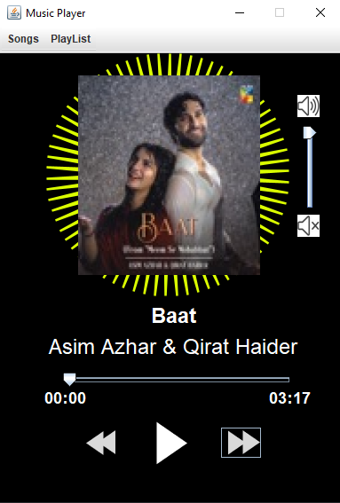
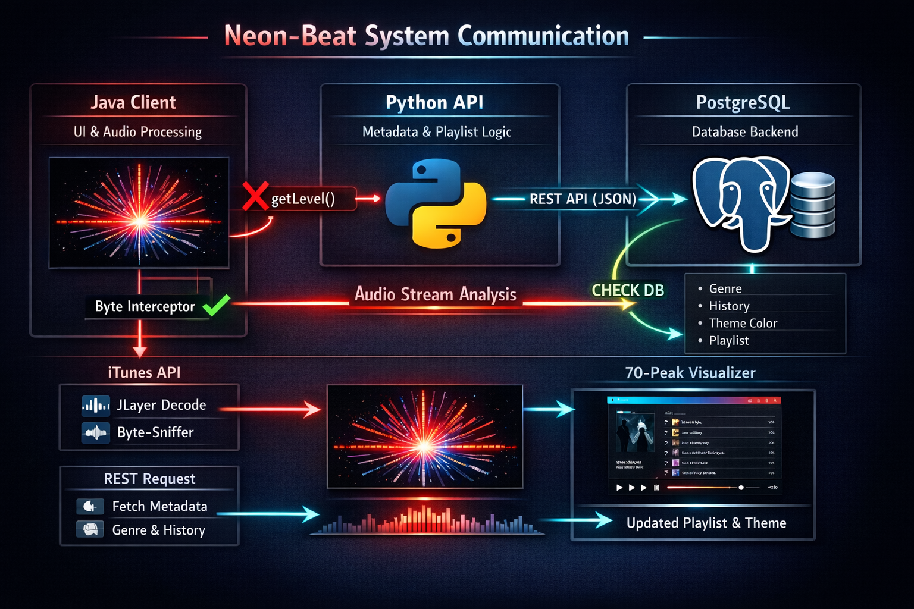
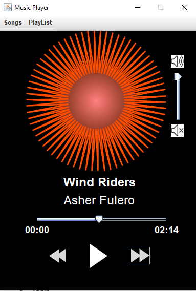
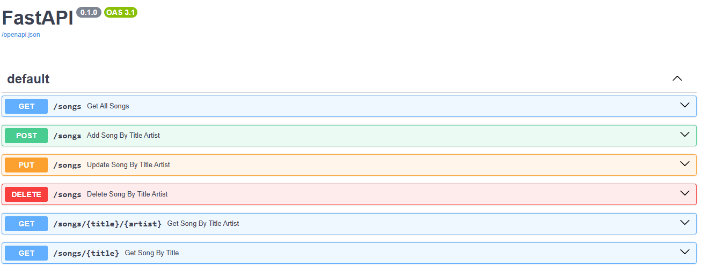
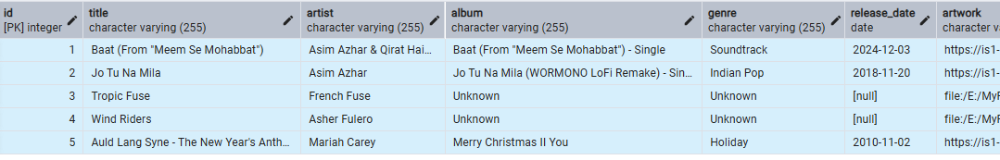

# NEON-BEAT: FULL-STACK AUDIO VISUALIZATION SYSTEM


## 1. PROJECT OVERVIEW
Neon-Beat is a high-performance desktop music player built using a hybrid architecture. It integrates a Java Swing frontend for real-time audio processing and a Python backend for data persistence and metadata management. 

The core technical highlight is a custom "Byte-Sniffer" that intercepts raw PCM audio data to drive a 70-peak dynamic star visualizer with sub-millisecond latency.

## 2. TECHNICAL ARCHITECTURE


### 2.1 Frontend (Java)
- Audio Engine: Utilizes JLayer (AdvancedPlayer) for MP3/WAV decoding.
- Real-Time Analysis: Custom override of the JavaSoundAudioDevice write method to perform Root Mean Square (RMS) calculations on the raw byte stream.
- Rendering: Custom Graphics2D implementation using Path2D to render 140 dynamic vertices (70 peaks) based on audio intensity and genre-based color mapping.
- Reflection Logic: Uses Java Reflection to access protected SourceDataLine fields for hardware-level volume control (Master Gain).



### 2.2 Backend (Python & PostgreSQL)
- API Layer: RESTful services built to manage song metadata and system configuration.
- Database: PostgreSQL manages relational data for song libraries, playlists, and genre classifications.
- Networking: The Java client communicates with the Python service layer via local networking (REST), ensuring a clean separation of concerns.
- ITUNES API: The API is used to retrieve available data on songs





## 3. SYSTEM FEATURES
- Dynamic Sharpness: The star visualizer modifies its inner radius factor (0.85 to 0.40) based on audio energy, creating a "pulsing" sharpness effect.
- Genre Color Intelligence: UI theme shifts automatically based on metadata (e.g., Deep Crimson for Rock/Metal, Spring Green for Pop, Golden Glow for Soundtracks).
- Non-Linear Sensitivity: Employs Gamma-corrected intensity logic to ensure visual responsiveness during quiet acoustic transitions.
- Persistent Data: Unlike traditional players, Neon-Beat saves playlist states and user preferences to a relational database.

## 4. INSTALLATION AND REQUIREMENTS

### 4.1 Prerequisites
- Java: JDK 17 or higher.
- Python: 3.9 or higher.
- Database: PostgreSQL 14 or higher.

### 4.2 Backend Setup
1. Navigate to the /backend directory.
2. Create a virtual environment: python -m venv .venv
3. Install dependencies: pip install -r requirements.txt

### 4.3 Frontend Setup
1. Import the project into your Java IDE.
2. Ensure the JLayer library and PostgreSQL JDBC driver are included in the classpath.
3. Run MusicPlayerGUI.java.

## 5. PROJECT STRUCTURE
```NeonBeat/
|-- src/main/
|   |-- java/com/musicplayer/
|   |   |-- app.java      	    (Main application unscript)
|   |   |-- LightingPanel.java      (Custom rendering logic)
|   |   |-- MusicPlayer.java        (Audio engine and byte-sniffer)
|   |   |-- MusicPlayerGUI.java     (UI components and event handling)
|   |   |-- Song.java     	    (Data class for songs)
|   |   |-- MusicPlayer.java        (Player data class for MP3)
|   |   |-- MusicPlayerWAV.java     (Player data class for WAV)
|   |   |-- ITUNESEndPoint.java     (Communication net)
|   |-- java/com/music_database_API/
|   |-- main.py                 (Python REST API)
|   |-- database.py             (Communication with Postgress database)
|   |-- database_schema.py     	(Pydantic schema for the Java data)
|   |-- song_schema.py     	(Pydantic schema for the song data class)
|-- assets/                 (Audio files and UI resources)
|-- libs/                   (Additional Java libraries)
|-- requirements.txt        (Python dependencies)
|-- pom.xml                 (Java Libraries)
|-- README.md               
```

## 6. AUTHOR
Ali Abbas Kapadia